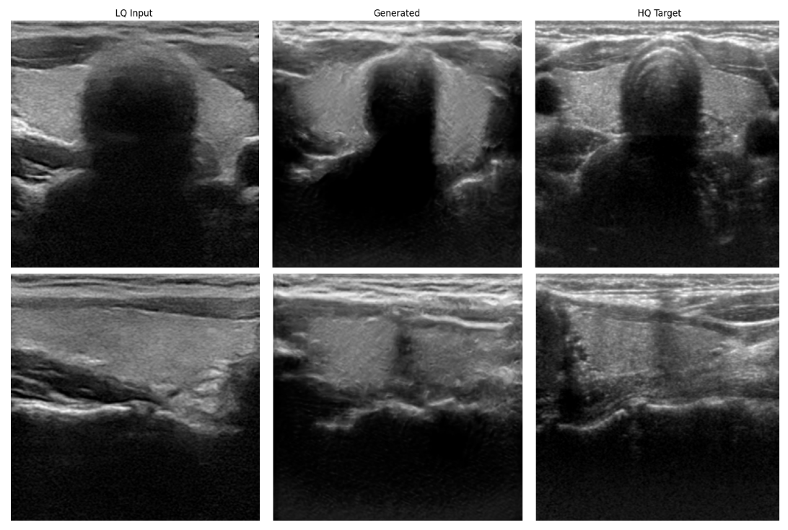

# Multi-Attention GAN for Ultrasound Image Enhancement

## Overview

- **Task**: Paired image-to-image translation: enhance low-quality (LQ) ultrasound images to high-quality (HQ) targets.
- **Architecture**: U-Net++ generator (ResNeXt-50 encoder, bilinear decoder) with a Conditional PatchGAN discriminator (baseline). The full proposed design adds a conditional parallel ViT discriminator and attention-augmented skip connections (see [Implemented vs. proposed](#implemented-vs-proposed)).
- **Adversarial training**: Relativistic Paired GAN (RpGAN) loss with R1 gradient regularization, following R3GAN.
- **Generator loss**: RpGAN adversarial + L1 + feature matching + MS-SSIM, balanced with learnable uncertainty-based weighting.
- **Dataset**: USenhance 2023 Grand Challenge (1050 paired LQ/HQ images).

## Key findings so far

- The baseline trains stably on a small dataset (1050 images) with RpGAN + R1 and learnable loss weighting, and validates the end-to-end training and data pipeline.
- Qualitatively, outputs show clearer tissue boundaries and suppressed coarse speckle relative to the LQ input.
- Quantitative scores are modest (SSIM 0.3476, PSNR 17.92 dB, LPIPS 0.3478). LQ and HQ domains differ substantially in speckle structure and tissue contrast, and the baseline has no global discrimination or frequency-domain supervision. These numbers are treated as a baseline to improve on, not a final result.

## Dataset

- **USenhance 2023 Grand Challenge**: paired LQ/HQ ultrasound images across diverse anatomical regions. Available at <https://usenhance.grand-challenge.org>.

Preprocessing: resize to 256 × 256, convert to grayscale, normalize to [0, 1]. 90/10 train/validation split with a fixed random seed.

Training-only augmentations (applied identically to the LQ/HQ pair): random horizontal/vertical flips, rotation (±10°), random crop to 220 × 220 resized back to 256 × 256, Gaussian noise (σ = 0.02), brightness jitter (×[0.8, 1.2]).

The dataset is not committed to this repo.

## Implemented vs. proposed

| Component | Implemented (baseline) | Proposed (future work) |
|-----------|------------------------|------------------------|
| Generator backbone | U-Net++, ResNeXt-50 encoder, bilinear decoder | Same |
| Skip connections | Direct pass-through | Triple-branch: direct + spatial attention + channel attention, fused via 1×1 conv |
| Normalization | Instance Norm throughout | Spectral Norm + Instance Norm at skips and bottleneck |
| Discriminator | Conditional PatchGAN (4 strided conv blocks, local only) | Conditional parallel ViT (patch tokens for local, CLS token for global) |
| Adversarial loss | RpGAN + R1 (γ = 0.1, real samples) | RpGAN + R1 + R2 (γ = 0.1) |
| Generator losses | RpGAN, L1, feature matching, MS-SSIM | Adds FFT and SVD losses |
| Loss weighting | Learnable uncertainty (4 terms) | Learnable uncertainty (6 terms) |

## Training setup

- **Optimizer**: AdamW (generator lr 1e-4, discriminator lr 3e-5).
- **Model selection**: best validation MS-SSIM, early stopping with patience 35 epochs.
- **I/O**: single-channel grayscale input, sigmoid output.

## Qualitative results

Two validation samples. Columns: LQ input, generated enhancement, HQ target.

## Limitations and future work

- PatchGAN supervises local realism only, with no mechanism for global anatomical coherence.
- Skip connections have no attention branches for selective structural preservation.
- No frequency-domain losses yet.

Planned upgrades:

1. Conditional parallel ViT discriminator (joint local + global heads).
2. Triple-branch attention skip connections.
3. Spectral Normalization at skip connections and the bottleneck.
4. FFT and SVD losses, with the uncertainty weighting extended to cover them.

## References

- USenhance 2023 Grand Challenge dataset.
- UltraGAN (Lei et al.), UltraDfeGAN (Kim et al.), RDC-GAN (Liu et al.).
- R3GAN: "The GAN is Dead; Long Live the GAN! A Modern Baseline GAN" (arXiv:2501.05441).
- UNet++ (Zhou et al., 2018); ViT (Dosovitskiy et al., ICLR 2021).
- SSIM (Wang et al., 2004); LPIPS (Zhang et al., CVPR 2018).
